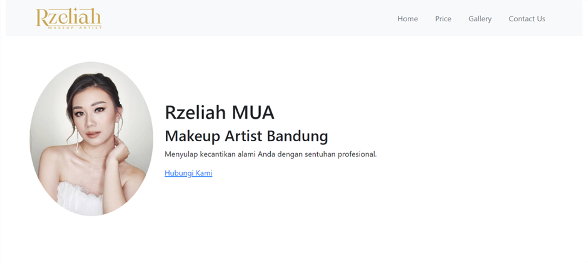

# 💄 Rzeliah MUA – Company Profile Website

Website ini merupakan proyek berbasis **Laravel** yang dikembangkan sebagai media promosi untuk bisnis makeup artist bernama **Rzeliah MUA**.  
Tujuan utama website ini adalah untuk menampilkan profil usaha, layanan makeup, galeri hasil karya, testimoni pelanggan, dan informasi kontak secara profesional dan mudah diakses oleh calon klien.

Website ini dirancang dengan tampilan **modern dan responsif**, menggunakan **Bootstrap** dan **Blade Template** agar dapat dibuka dengan baik di berbagai perangkat, baik desktop maupun mobile.  
Struktur halaman dibuat sederhana agar pengguna dapat langsung menemukan informasi yang dibutuhkan tanpa navigasi yang rumit.

### ✨ Fitur Utama
- **Home & About** — menampilkan profil dan latar belakang Rzeliah MUA.  
- **Gallery** — menampilkan hasil karya makeup secara visual.  
- **Price List** — daftar layanan dan harga yang ditawarkan.  
- **Testimonials** — menampilkan umpan balik dari klien.  
- **Contact** — berisi informasi kontak dan media sosial.

### 🧩 Teknologi yang Digunakan
Website ini dibangun menggunakan:
- **Laravel Framework** (PHP)
- **Blade Template Engine**
- **Bootstrap** untuk tampilan responsif
- **MySQL** untuk penyimpanan data
- **Laragon** sebagai local development environment

Website ini bersifat **statis**, namun tetap memanfaatkan konsep **MVC (Model–View–Controller)** agar struktur kode lebih rapi dan mudah dikembangkan.  
Proyek ini juga menjadi sarana pembelajaran dalam memahami penerapan framework Laravel untuk pembuatan website portofolio atau company profile sederhana.

---

Dikembangkan oleh **Frendi Widsna**  
📍 Bandung, Indonesia  
📧 [frendiwidsna16@gmail.com](mailto:frendiwidsna16@gmail.com)  
🔗 [LinkedIn](https://www.linkedin.com/in/frendi-widsna-36b000267) | [GitHub](https://github.com/FingrenF)
